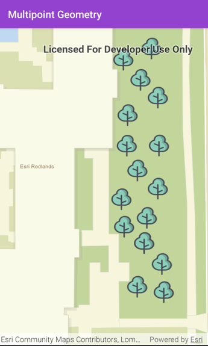
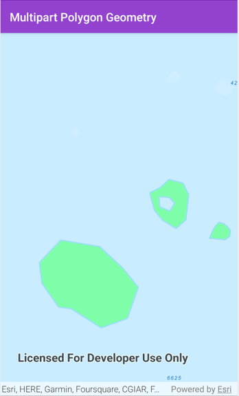
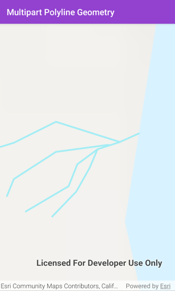

# Multipart-Geometry
Creating Multipart Polygon, Polyline and Multipoint geometry using ArcGIS Maps SDK for Kotlin

## Overview
This repository contains the code which is mentioned in the blog post `Mapping complex data with Multipart Geometries using the ArcGIS Maps SDKs for Native Apps.`

It creates collection of trees representing the multipoint geometry, multiple islands and a lake within an island represented as a single multipart polygon geometry, 
a river branching into many streams representing multipart polyline geometry.

## Prerequisites

* The example apps in this project are building with `compileSdkVersion 33`
* [Android Studio](http://developer.android.com/sdk/index.html)
* [An ArcGIS Developers API key](https://developers.arcgis.com/kotlin/get-started/#3-get-an-api-key)


## Developer Instructions

Please read our [developer instructions wiki page](https://github.com/Esri/arcgis-maps-sdk-kotlin-samples/wiki/Developer-Instructions) to set up your developer environment with Android Studio.  Instructions include forking and cloning the repository for those new to Git.

Once the project is cloned to disk you can import into Android Studio:

* From the Welcome to Android Studio screen, click the **Open** button. (If you're already inside a project, click **File > Open** in the menu bar instead.)
* Navigate to the **Multipart_Geometry/** folder and click **OK**.

## Accessing Esri location services

Accessing Esri location services, including basemaps, routing, and geocoding, requires authentication using either an API Key or an ArcGIS identity:

### API key

A permanent key that gives your application access to Esri location services. Visit your [ArcGIS Developers Dashboard](https://developers.arcgis.com/dashboard) to create a new API key or access an existing API key.
The Android samples in this repository have been structured to use an API key, set once, which will run in all samples.
Set your API key in the `gradle.properties` file located in the `/.gradle` folder within your home directory.
The API_KEY property should contain quotes around the key itself:
```gradle
API_KEY = "YOUR_API_KEY" // path: /Users/<user_name>/.gradle/gradle.properties
```

## Run a sample

Once you have set up your developer environment you can run any sample from within Android Studio by selecting the app module from the **Edit Configurations** drop down and clicking the **Run** button from the toolbar.






